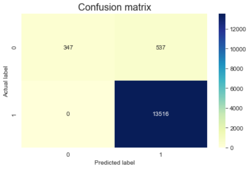

   

  

# Luiz Carlos Vieira
 *A Biologist*  seeking to improve your knowledge in biology throughout by bioinformatics 

I hold a bachelor's degree in Biological Sciences and a Master's degree in Science from the Department of Cellular and Molecular Biology and Pathogenic Bioagents.

I have professional experience as a Laboratory Technician (Trainee) and Researcher (Master's Student) at the Virology Research Center (USP). I also worked as a Quality Control Analyst where I performed quality control tests for viral vaccines.

**Background in:** Cell and molecular Biology, Virology, Genomics, Python, R, linux, Data Analysis.

**Links:**
* [LinkedIn](https://www.linkedin.com/in/luiz-carlos-vieira-4582797b/)

## About this Project:

* The data used in this analysis correspond to the report of 28k samples analysed by Quality Control. These samples were quantified after DNA extraction, DNA fragmentation, library preparation and sequencing. Then this data was used to flag bad samples.   

* The analysis consists of finding answers to some questions related to the quality of samples, statistics, data mining and data visualization.   

* Feel free to use all and share some contributions to improve them too.

---

